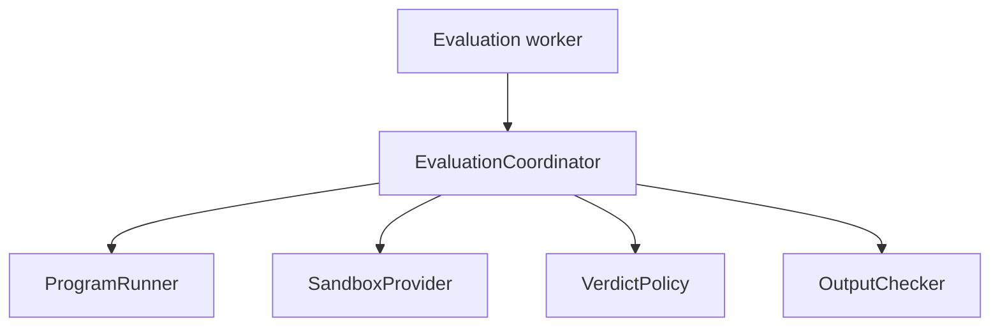

# Engine architecture

The engine is a library with one orchestration facade and several narrow policy
boundaries.

| Path | Responsibility |
|---|---|
| `core/bundle.py` | Read `challenge.json`, budget, suite, and evaluator |
| `core/session.py` | Compile once and execute ordered cases |
| `core/runner.py` | Prepare runtime commands |
| `core/sandbox.py` | Describe the replaceable isolation boundary |
| `core/verdicts.py` | Convert process observations to verdicts |
| `core/checking.py` | Token and custom output evaluation |
| `platform/linux/` | Linux process, deadline, cgroup, and accounting adapters |
| `fixtures/` | Small executable contract examples |

The worker owns delivery, retries, and database commits. The engine owns only the
meaning of evaluating a source artifact against a challenge revision.

The process-backed sandbox is suitable for development and capability tests. A
production provider must enforce filesystem, network, process-count, CPU, and
memory policy without relying on application-layer trust.
